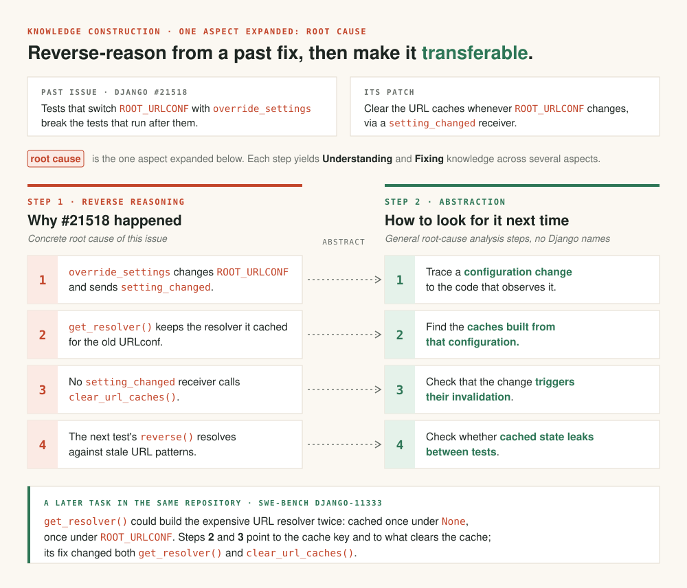

# Lingxi Advisor

**Help your coding agent learn from how a repository's problems were solved before.**

Lingxi Advisor is an **online version** of the procedural-knowledge approach introduced in the Lingxi paper. The paper builds knowledge offline and uses retrieval and reranking over the prepared knowledge base, requiring substantial preparation. Advisor instead uses GitHub APIs to find relevant historical issues and patches and constructs knowledge on demand. Its retrieval quality and downstream effectiveness may fall short of the paper's offline approach. [More about the differences](#research).

[](https://arxiv.org/pdf/2510.11838) [](https://arxiv.org/abs/2510.11838) [](https://conf.researchr.org/details/issta-2026/issta-2026-research-papers/179/Lingxi-Repository-Level-Issue-Resolution-Framework-Enhanced-by-Procedural-Knowledge-)

[Project page](https://www.jiayuanzhou.com/blog/lingxi/) · [iCode coding agent](https://github.com/openJiuwen-ai/iCode) · [Quickstart](#quickstart) · [Documentation](#advanced-usage-and-documentation) · [Release plan](#release-plan) · [Citation](#citation)

## News

- **ISSTA 2026** — Lingxi received a **Distinguished Paper Award**! [Conference listing](https://conf.researchr.org/details/issta-2026/issta-2026-research-papers/179/Lingxi-Repository-Level-Issue-Resolution-Framework-Enhanced-by-Procedural-Knowledge-).

## Overview

Lingxi Advisor turns historical GitHub issues, patches, and code context into reusable guidance: where to investigate, which mechanisms to check, and how previous fixes can inform a new task.

### When to use it

Use Lingxi Advisor when your agent is working in a repository with relevant issue and patch history—for example, investigating unfamiliar behavior, extending a feature that has changed before, or looking for regression cases that earlier fixes uncovered.

The agent receives procedural knowledge: methods and checks it can apply to the current task, together with references to the historical sources.

### What the knowledge looks like

Each knowledge record covers understanding and fixing the issue, built in two steps:

| | Step 1 · this issue (12 sections) | Step 2 · transferable (10 sections) |
|---|---|---|
| **Understanding** | where the issue sits in the code and how it is called; what went wrong and **why (root cause)**; when it is triggered | architecture and components to know; **how to diagnose this kind of issue**; the affected feature |
| **Fixing** | what the fix changed and how; checks and tests; a summary | a reusable fix pattern and checklist; design practices to follow |

[All sections](plugins/lingxi-advisor/docs/usage.md#knowledge-structure).

**Example: a cache-invalidation fix.** In [Django #21518](https://code.djangoproject.com/ticket/21518), tests changed their URL configuration with `override_settings`, but the URL resolver kept stale cached state. The [fix](https://github.com/django/django/commit/65131911dba08dcc1451d71ae4d5101724d722f6) connected configuration-change notifications to cache clearing.
The diagram expands the bold phrases for this issue: one root cause, and the steps it becomes.



*Condensed from historical knowledge-extraction records. The later task
([Django PR #11333](https://github.com/django/django/pull/11333), ticket #29744) shows where these steps point
in a real patch; it is not a measured Advisor result.*

---

## Quickstart

> **Try Lingxi Advisor with [iCode](https://github.com/openJiuwen-ai/iCode).** iCode is an open-source coding-agent and workflow toolkit with configurable agents, models, and workflows. The Advisor integration supports both on-demand historical guidance and advance knowledge preparation.

### 1. Prepare access

You need Node.js 18+, Python 3.12, `uv`, and a supported coding agent.

Make `GITHUB_TOKEN` available to the installer and to the environment that starts your agent and its MCP services. Advisor uses it to retrieve GitHub issues and patches.

Screening and generating knowledge also require a model. Advisor can use your agent's model when the host supports MCP sampling. Otherwise, follow the [independent model setup](plugins/lingxi-advisor/docs/usage.md#model-configuration).

### 2. Install

```sh
git clone https://github.com/spine-se-lab/Lingxi-advisor.git
cd Lingxi-advisor
npm install
npx . install
```

The installer detects or asks for your target agent and shows an installation plan. See the [installation guide](plugins/lingxi-advisor/docs/usage.md#installation) for explicit host selection.

Packaged targets: **[iCode 0.28](https://github.com/openJiuwen-ai/iCode), OpenCode 1.x, Pi 0.85.1, Codex 0.136.x, Claude Code 2.1.285, and DeepSeek Harness 0.2.0-rc.2**. The Codex target has fixture/contract validation; see [host details](plugins/lingxi-advisor/docs/usage.md#host-details) for compatibility and verification scope.

### 3. Try it on a task

Give your agent the repository and issue you want to work on:

```text
Use Lingxi Advisor to find relevant historical experience for
owner/repository issue #123, then use it to investigate and fix the issue.
```

Or describe a task that has not been filed as an issue:

```text
In owner/repository, I want to add an option to skip startup checks.
Use Lingxi Advisor to find relevant experience before implementing it.
```

Replace the repository and issue number with your own. Start with the default settings; you do not need to choose a knowledge-generation method or prepare a knowledge library first.

**Optional settings page:** after installation, run `npx . config-ui` to inspect or adjust defaults. Opening it is optional. Restart or reload the agent after changing settings.

## What happens when you use it


### Expect some preparation time

On-demand use can involve GitHub searches, fetching repair context, model-based screening, and knowledge generation. These steps add waiting time before the agent can use the guidance.

Existing knowledge can avoid repeated generation. A new task may still need GitHub retrieval and screening, even if you have used Advisor on the repository before. Request time depends on the available history, network and API conditions, model, and preparation work.

### Preparing knowledge ahead of time

For recurring work, you can prepare knowledge for a set of tasks individually or in batches through the preparation operator on iCode and OpenCode. This moves some work ahead of the coding session and allows prepared results to be reused where they match.

Batch preparation does **not** guarantee that every future task can be answered entirely from local data. New tasks may still need retrieval or screening. See [advance preparation and reuse](plugins/lingxi-advisor/docs/usage.md#advance-preparation-and-reuse) for the distinction.

## Advanced usage and documentation

Knowledge can be extracted from issue–patch context alone or with additional exploration of the historical repository. These are knowledge-construction options; you can start with the defaults and explore them later.

- [Installation, credentials, and optional settings](plugins/lingxi-advisor/docs/usage.md#installation)
- [Task inputs](plugins/lingxi-advisor/docs/usage.md#task-inputs)
- [Knowledge structure: the 12-section analysis and 10-section summary](plugins/lingxi-advisor/docs/usage.md#knowledge-structure)
- [Knowledge-construction methods](plugins/lingxi-advisor/docs/usage.md#knowledge-preparation)
- [Preparation time, batches, and reuse](plugins/lingxi-advisor/docs/usage.md#preparation-time)
- [Development](plugins/lingxi-advisor/docs/usage.md#development)

## Research

Lingxi studies how procedural knowledge reconstructed from past repairs can guide multiple analyses and combine complementary findings. The paper reports **74.6% resolved on SWE-bench Verified** for its research system.

The online Advisor supplies knowledge through Search/Apply for a host coding agent. It does not reproduce the paper's full parallel exploration and aggregation workflow, and the paper's score is not a benchmark result for this plugin. [Read about the paper–plugin relationship](plugins/lingxi-advisor/docs/usage.md#relationship-to-the-paper).

## Release plan

| Item | Status |
|---|---|
| [Paper PDF](https://arxiv.org/pdf/2510.11838) and [arXiv preprint](https://arxiv.org/abs/2510.11838) | ✅ Available |
| Lingxi Advisor: knowledge construction and retrieval from historical issues and patches | ✅ Available — [Quickstart](#quickstart) |
| Experience extracted from agent execution trajectories | 🚧 In development — will be integrated into the same Advisor |
| Evaluation-suite integration with [eval-kit-swe-pro](https://github.com/spine-se-lab/eval-kit-swe-pro) | 🚧 In progress — [integration notes](plugins/lingxi-advisor/docs/usage.md#evaluation-integration) |

---

## Citation

If Lingxi Advisor or its underlying ideas contribute to your research, please cite the paper, published in *Proceedings of the ACM on Software Engineering*, the **ISSTA 2026** issue ([ACM publication](https://doi.org/10.1145/3832270)):

```bibtex
@article{yang2026lingxi,
  title   = {Lingxi: Repository-Level Issue Resolution Framework Enhanced by
             Procedural Knowledge Guided Scaling},
  author  = {Yang, Xu and Zhou, Jiayuan and Pacheco, Michael and Zhu, Wenhan and
             He, Pengfei and Wang, Shaowei and Liu, Kui and Pan, Ruiqi},
  journal = {Proceedings of the ACM on Software Engineering},
  volume  = {3},
  number  = {ISSTA},
  pages   = {4096--4117},
  year    = {2026},
  doi     = {10.1145/3832270},
  url     = {https://doi.org/10.1145/3832270}
}
```

## Maintainers

- Jiayuan Zhou
- Tongwei Zhang

## License

MIT License. See [LICENSE](LICENSE).
